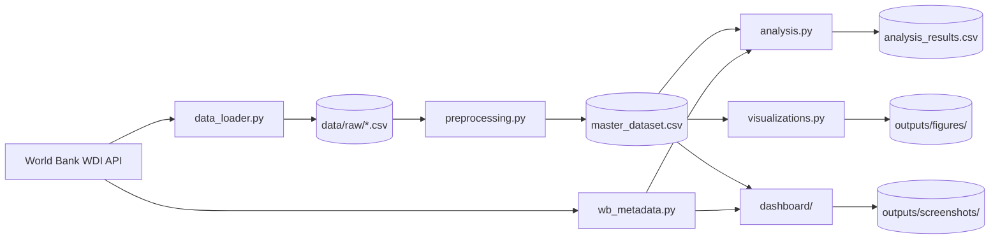

# NXP Life Expectancy Dashboard — Architecture

## Overview

This project implements an end-to-end analytics pipeline for World Bank health
indicators: extract, transform, analyze, visualize, and present insights through
an interactive Streamlit dashboard.



## Layered design

| Layer | Modules | Responsibility |
|-------|---------|----------------|
| Configuration | `config.py` | Paths, constants, color palettes, shared schema |
| Infrastructure | `logging_config.py`, `exceptions.py`, `wb_metadata.py` | Logging, errors, cached World Bank metadata |
| Data ingestion | `data_loader.py` | Download and parse WDI CSV exports |
| Transformation | `preprocessing.py` | Wide-to-long conversion and master merge |
| Analytics | `analysis.py` | Statistical questions and CSV export |
| Static visuals | `visualizations.py` | Plotly maps, Sankey, trend exports |
| Presentation | `dashboard/` | Streamlit UI, filters, KPIs, charts |

## Dashboard module layout

```
dashboard/
├── app.py                 # Streamlit entry point and error boundaries
├── styles.py              # Page config, CSS, Plotly config
├── services/
│   └── data_service.py    # Cached data loading and filtering
└── components/
    ├── charts.py          # Plotly figure builders
    ├── filters.py         # Sidebar controls
    ├── kpi.py             # KPI cards
    └── data_table.py      # Tabular view and CSV download
```

## Data flow

1. **Ingestion** — `data_loader.py` downloads five WDI indicators or reads cached
   CSV files from `data/raw/`.
2. **Preprocessing** — `preprocessing.py` melts wide year columns into long format
   and outer-joins indicators on `(Country, Country_Code, Year)`.
3. **Master dataset** — `master_dataset.csv` is the canonical analytical table.
4. **Metadata enrichment** — `wb_metadata.py` fetches income group and region
   mappings once, caches them in `data/cache/wb_countries.json`, and reuses them
   across analysis and dashboard modules.
5. **Consumption** — Analysis, static visualizations, and the dashboard read from
   the master dataset and shared metadata cache.

## Caching and performance

| Cache | Location | TTL / Scope |
|-------|----------|-------------|
| Raw WDI CSVs | `data/raw/` | Persistent until force refresh |
| WB country metadata | `data/cache/wb_countries.json` | Persistent; refreshed on demand |
| Streamlit data frames | In-memory `@st.cache_data` | 1–24 hours depending on function |
| World GeoJSON | `data/world_110m.json` | Persistent after first download |

Performance improvements in the dashboard layer:

- Vectorized boolean filtering instead of repeated DataFrame copies
- Single World Bank metadata fetch shared across modules
- Cached country-level enrichment separate from filter state
- Tabbed layout to reduce initial render pressure

## Error handling

Custom exceptions in `exceptions.py`:

- `DataLoadError` — Missing or unreadable datasets
- `MetadataFetchError` — World Bank API or cache failures
- `PipelineError` — ETL or batch analysis failures
- `DashboardError` — Base class for UI-facing failures

The Streamlit app catches load and metadata errors before rendering and displays
actionable messages (for example, prompting users to run `preprocessing.py`).

## Outputs

| Directory | Contents |
|-----------|----------|
| `outputs/figures/` | HTML and PNG static visualizations |
| `outputs/screenshots/` | Dashboard chart PNG exports |

Generate assets with:

```bash
python scripts/export_assets.py
```

## Coding standards

- Python 3.10+ type hints throughout
- PEP 8 layout enforced via `pyproject.toml` (`ruff`/`black` compatible settings)
- Module-level loggers using `logging_config.get_logger`
- Constants centralized in `config.py` to avoid duplication

## Extension points

- Add new indicators in `data_loader.INDICATORS` and `_VALUE_COLUMN_MAP`
- Add dashboard charts in `dashboard/components/charts.py`
- Add analysis questions in `analysis.py` and export via `export_analysis_results`
